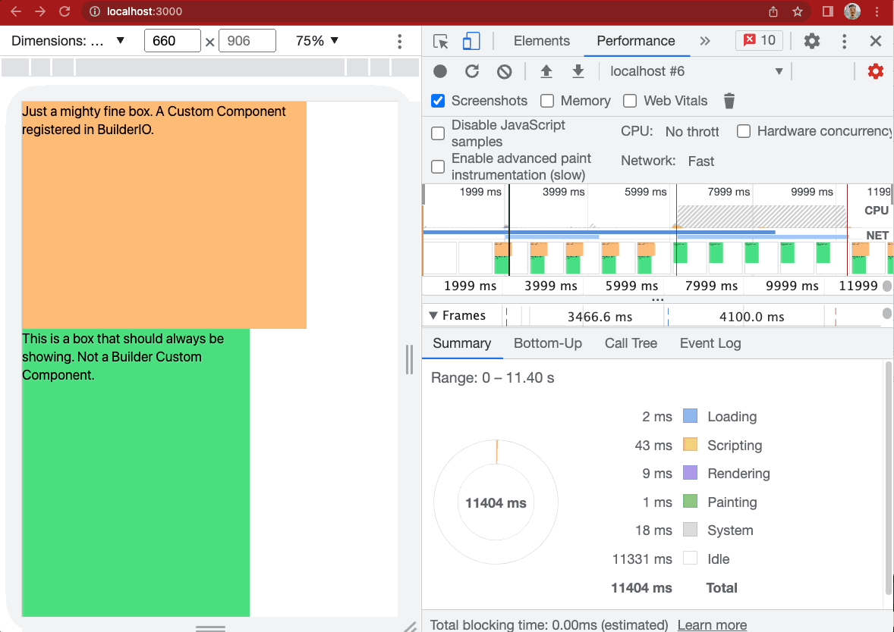

# bldr

## Build Setup

```bash
# install dependencies
$ yarn install

# generate static project
$ yarn generate

# start project
$ yarn start
```

## Testing Instructions
1. Do the above, and then open up http://localhost:3000 (or whatever port you're on)
2. in chrome, right click inspect, and look for the Performance tab (usually tucked away under the >> button)
3. Change network from no throttle to Fast 3G or Slow 3G
4. Press refresh button inside inspect mode (command+shift+e for mac)
5. Observe the flicker. The orange box is a custom component registered in builder. We starts from
loading up dist/index.html where it is available, and then it goes away and comes back. If hydration
matched well, we shouldn't have the element itself disappear.
6. Observe the difference between the final output that is in dist/index.html (you can find it in ./distIndex.html) and the client-side final rendering (./clientSideIndex.html)

